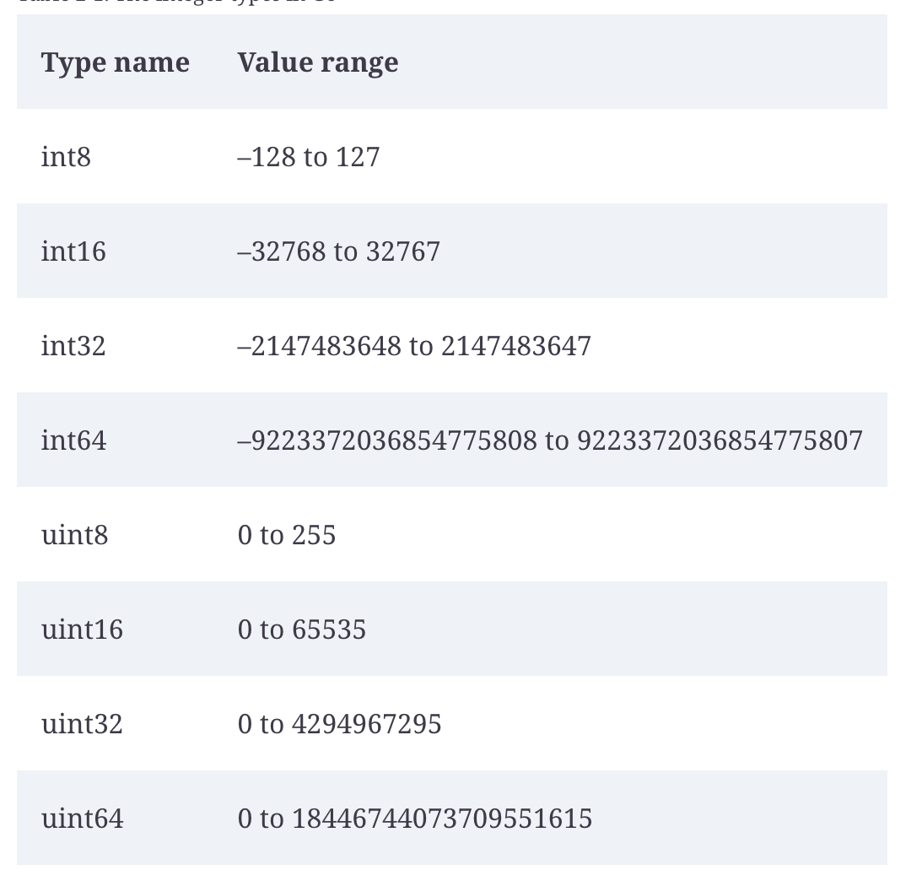

# Primitive Types

* Go assigns a default zero value to any variable that is declared but not assigned a value.

## Literals

* you can change the base of a number using: `0b`, `0o` (octal) and `0x` (hexadecimal)
* You can also do `1_234` to simplify reading large numbers
* `''`and  `""` are different
* You can also use backquote (`\``) for raw strings
* Literals in go does not have a type, so you can assign an integer literal to a floating point var (this only works with related types, of course)


## Assigning a type

```golang
var flag bool
var num int
```

## Int types


* `byte` is an alias for `unit8`
* `int` is an alias for `int32` in 32 bits cpu and `int64` in 64 bits cpu
* Use `int64` or `uint64` when writing functions to be able to receive any other type of integer (because there is no generics (yet))

### Arithmetics

* The result of an integer division is an integer

## Float types

* There are two; `float32` and `float64`. Use always the 64
* They can be exact like in all other programming languages
* You should not use `==` and `!=` with floats, because of the inexact precision nature
* Fun fact: there is a `complex` type, and you can use `real()` and `imag()` functions


## String types

* The zero value is `""`
* Strings are immutable: you can reassign but cannot change the value (??)
* the `rune` type is an alias to `int32` and represents a single character
* 


## Explicit Type Conversion

* Go does not allow automatic type promotion between variables. It needs the casting when trying to do operations with other typed variables
* You cannot treat another Go types as boolean, _implicitly_ or _explicitly_. YOu need to check the variable truthyness with one of the comparison operators


## Declaring variables (var vs :=)

* Ways of declaring a variable:

```golang
var x int = 10
var x = 10 // you can remove the type if it is already expected
var x int // define with default 0 type
var x,y int = 10,20 // same type
var x,y = 10, "hello"

var (
    x    int
    y        = 20
    z    int = 30
)
```

* Go also supports a short declaration, that uses type inference:

```golang
x := 10
x,y := 10, "hello"

```

* := cannot be used outside of functions


## Const

* `const` is very limited, it can only give names to literals, it needs to figure out the value at compile time
* It is a great thing to maintain the constant untyped because it allows it to be used in any other variable type

```golang
const x = 10
var y int = x
var z float64 = x
var d byte = x
```

## General Rules
* the compiler checks and complains when there are **unused variables**. 
* go uses **Camel Case**
* About short named variables:

> These short names serve two purposes. The first is that they **eliminate repetitive typing**, keeping your code shorter. Second, they serve as a check on how complicated your code is. If you find it hard to keep track of your short-named variables, it’s likely that your block of code is doing too much.
